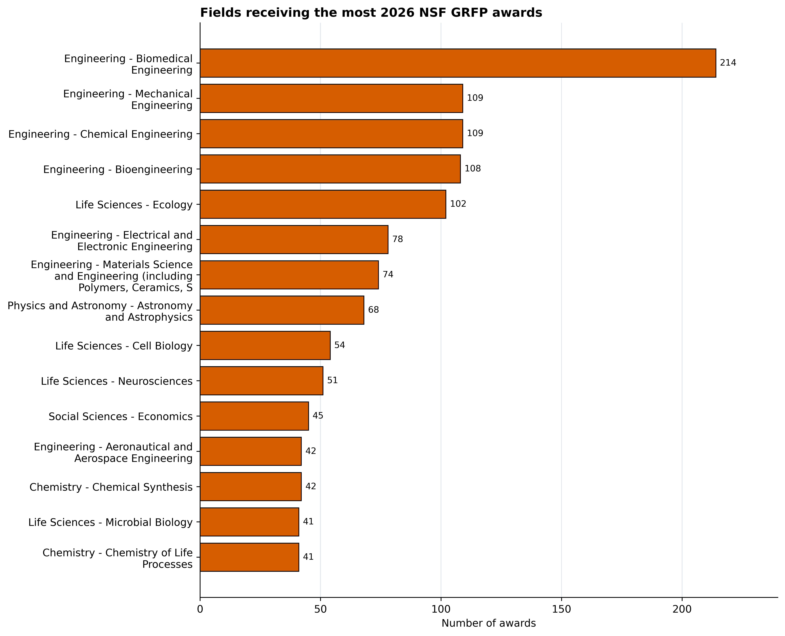
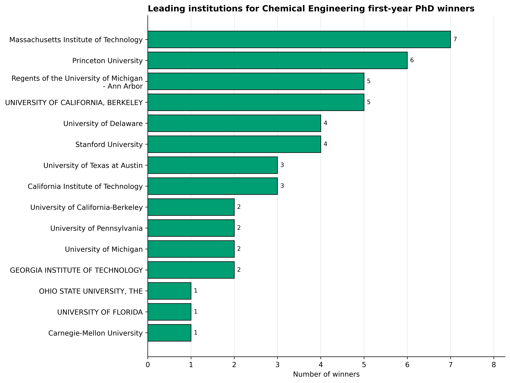

This report summarizes how 2026 NSF GRFP awards are distributed across fields of study and institutional pathways.

## Awards by field of study

::: {.callout-note appearance="minimal"}
Total awards by field, separated into matching-institution winners and winners with a non-null current institution that differs from the baccalaureate institution.
:::

{#fig-top-fields width="100%" fig-alt="Horizontal bars showing the 15 fields of study receiving the most awards."}

{#fig-field-pathways width="100%" fig-alt="Grouped horizontal bars comparing same-institution and different-institution winners across highly awarded fields."}

::: {.table-responsive}

:::

## Chemical Engineering first-year PhD student winners

::: {.callout-note appearance="minimal"}
Chemical Engineering winners with a non-null `Current Institution` that differs from their `Baccalaureate Institution`, counted by current institution.
:::

{#fig-chem-e-phd-institutions width="100%" fig-alt="Horizontal bars showing the leading current institutions for Chemical Engineering first-year PhD student winners."}

::: {.table-responsive}

:::

## Chemical Engineering senior undergraduates

::: {.callout-note appearance="minimal"}
Chemical Engineering winners whose `Current Institution` equals their `Baccalaureate Institution`, meaning the winner was a senior undergraduate.
:::

::: {.table-responsive}

:::

## Other winners (gap year etc.)

::: {.callout-note appearance="minimal"}
Chemical Engineering winners with a missing (`NaN`) `Current Institution`, indicating that no current institution was listed.
:::

::: {.table-responsive}

:::
